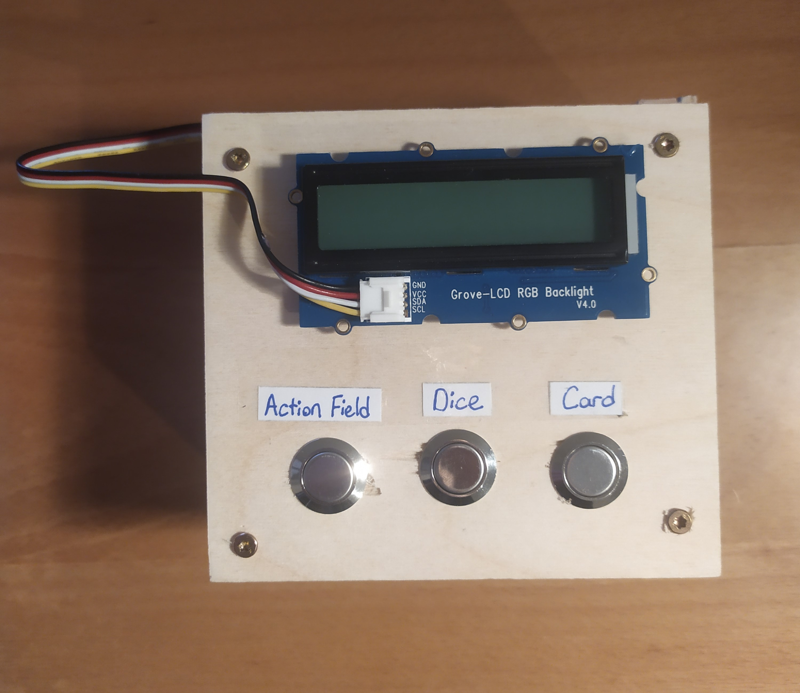
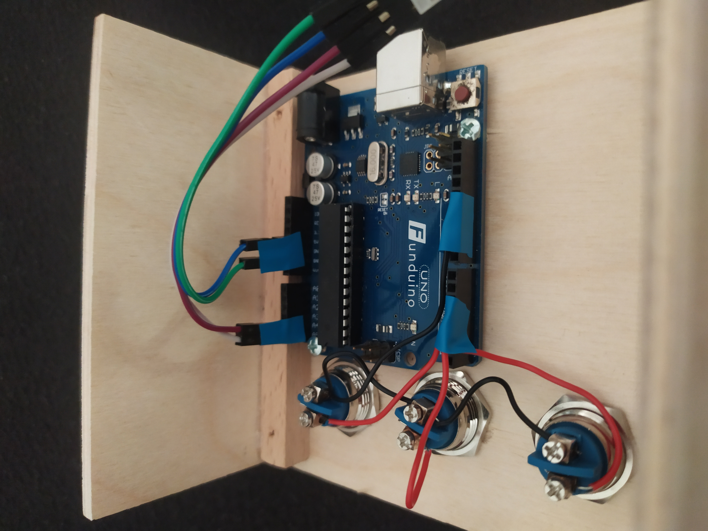
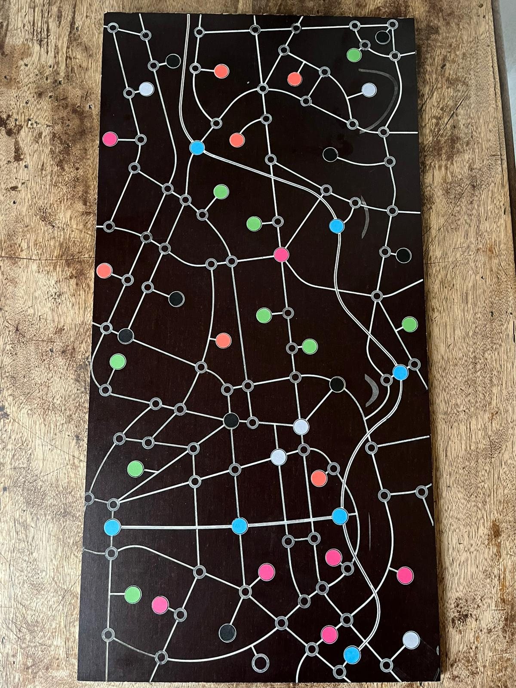
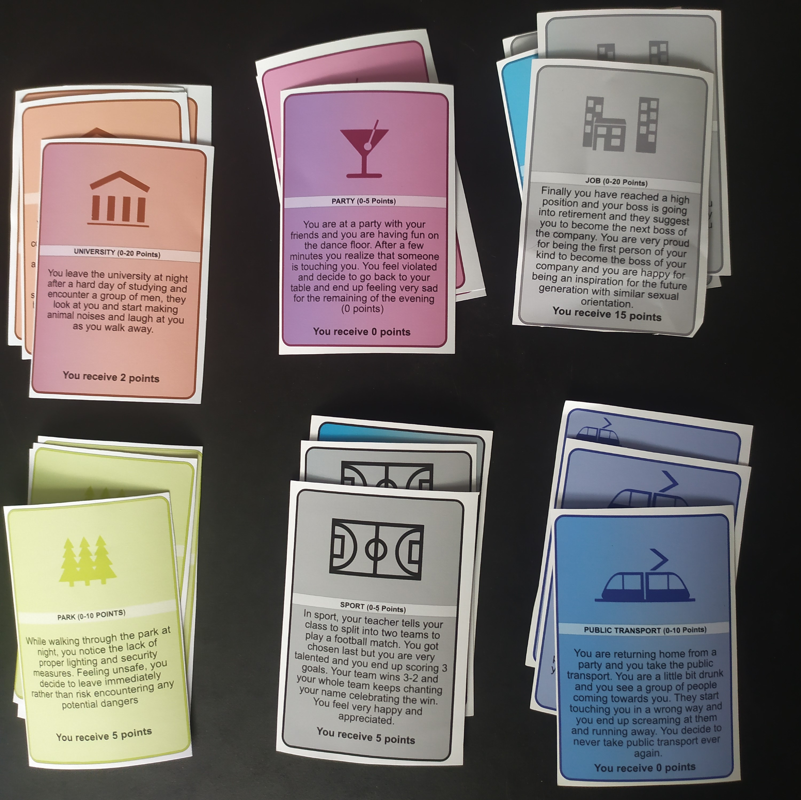
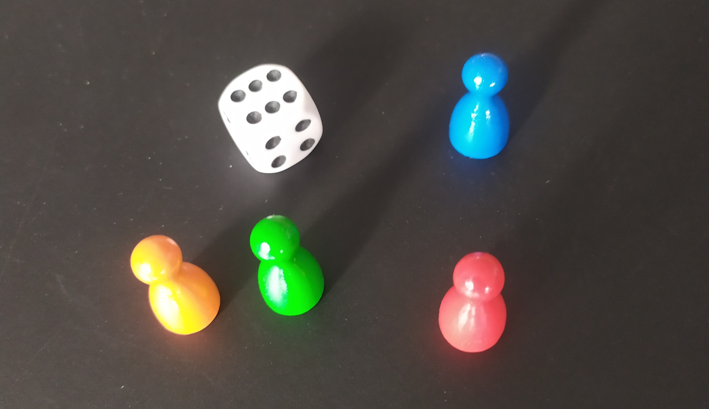

# Public Safety Group | Board Game with Arduino

## Hacking Innovation Bias | SoSe 2024

### How to use Arduino?

* Clone the project: `git clone https://github.com/errdemk/public-safety.git`
* Open the project in Arduino IDE
* Plug in the Arduino board
* Select **Board** and **Port** in the **Tools** section
* **Verify** and **Upload** the code
* Try **Action Field**, **Dice** and **Card** buttons
* **Arduino artifact:**

### Other components

* **Game board:**

* **Cards:**

* **A dice and the figures:**

